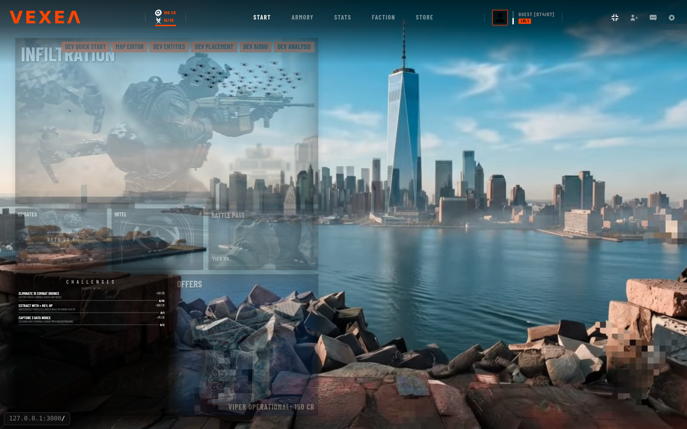
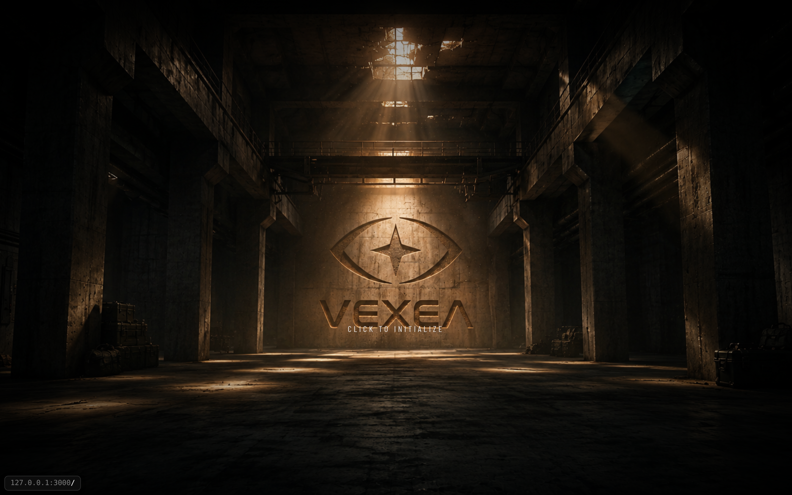
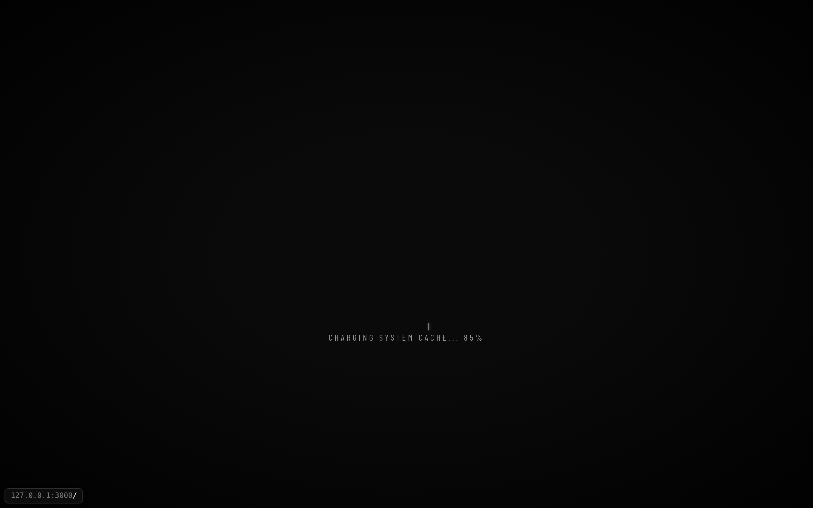

# VEXEA Agent Handoff

Read this file first. This branch is a checkpoint for the weapon/utility pose-alignment task. It is not a claim that the final gameplay view is working.

## Active requirement

Align every relevant weapon and utility item so the presentation is believable from both first-person and third-person views.

The item must:

- sit naturally relative to the player's hands/body and camera;
- have a believable orientation, scale, grip relationship, and business-end direction;
- remain connected and readable in third-person without excessive floating or clipping;
- represent the same underlying physical action in both views;
- remain coherent during ordinary player movement;
- be ready for normal player-controlled gameplay recording, not a scripted or fake recording.

Keep the smallest coherent change. Do not redesign the camera, animation system, combat, movement, networking, matchmaking, AI, physics, or server.

Hard constraints:

- Do not touch server logic, networking, combat/hitscan, physics behavior, input, camera interpolation, or unrelated bugs.
- Continue using `three/webgpu`; `THREE.WebGLRenderer` is forbidden.
- Do not hide clipping with arbitrary screen-space placement or undocumented magic offsets.
- Do not remove files or silently revert existing work. If a current change is out of scope, identify it for review and explain the safe disposition.
- Acceptance requires browser evidence from both first- and third-person views. Passing unit tests alone is not enough.

## Separate historical task

One attached prompt concerned first-person camera jitter caused by fixed-step physics and requested render interpolation. That is a separate task. Do not merge it into this pose task or use it as a reason to change camera/physics code unless the user explicitly re-scopes the work.

## What this checkpoint contains

Base before this checkpoint: `96a94a87a635257f39c785b15ae714c87a3e3f12` (`build: upgrade Three.js to r186`).

The current branch is `hoplite/pellene-61cfde19`. Use `git log -1` for the exact checkpoint commit after checkout.

The current implementation work includes:

- `client/weapons/pose-solver.ts`: authored/candidate/procedural grip-anchor resolution and pose diagnostics.
- `client/src/systems/player-visual-calibration.ts`: player visual normalization/calibration.
- `client/dev_pose_diagnosis.ts`: development-only pose diagnostic panel and catalog checks.
- `client/weapons_model.ts`, `shared/asset-details.ts`: weapon template/socket/asset-contract changes.
- `client/src/systems/RemotePlayerSystem.ts`, `client/MatchController.ts`: remote player/weapon ownership and disposal changes.
- `client/dev_menu.ts`: exposes the `POSE DIAG` panel.
- `client/src/map/LoadingOrchestrator.ts`, `client/src/systems/NetworkSyncSystem.ts`: additional current edits; review these carefully for scope creep before treating them as required for pose alignment.
- `tests/pose-solver.test.ts`, `tests/weapon-contracts.test.ts`: focused contract and solver coverage.
- `.hoplite/settings.json`: Preview inference metadata and an explicit `PORT=3000 npm run dev` run command. This was added while diagnosing Preview lifecycle behavior and is not proof that it is the correct long-term project configuration.
- `package-lock.json`: Three.js/type lock updates and npm lockfile normalization.
- `bun.lock`: currently deleted in the worktree. Treat this as an explicit review item; do not assume the deletion is part of the pose feature.
- `client/public/basis/README.md` and `client/public/draco/README.md`: setup synchronization changed these files; they are not pose logic and should be reviewed as generated/environment changes.

The originating workspace also contains private `.hoplite/attachments/`; those are intentionally not part of this handoff commit.

## Verified so far

- Focused tests pass: `npx vitest run tests/pose-solver.test.ts tests/weapon-contracts.test.ts --reporter=dot` → 2 files, 45 tests passed.
- `git diff --check` passes.
- A prior `npx vite build --sourcemap false` completed successfully; rerun in the fresh instance before claiming a current build pass.
- The known repository-wide TypeScript blocker remains `benchmarks/diagnostics/measure_benchmark_ipc.ts(27,5): error TS2353: 'profile' does not exist in type 'RunnerOptions'`.
- The full server starts and serves the client on port 3000. The browser reaches the initialization/main-menu UI.
- Retained asset checks did not show a worker-image or GLB HTTP failure, but asset delivery and gameplay rendering are separate claims and must be rechecked in the fresh instance.

## Current blocker and exact evidence

The first meaningful 3D match startup fails in the browser before pose inspection:

```text
TypeError: Cannot read properties of null (reading 'getSupportedExtensions')
  at WebGLBackend.init
  at WebGPURenderer.init
  at setup3DStage (client/main.ts:640)
  at initClient (client/main.ts:413)
```

A downstream error follows:

```text
THREE.PMREMGenerator: .fromScene() called before the backend is initialized.
```

The browser snapshot can still show `ROTATE DEVICE` and `CLICK TO INITIALIZE` because those are ordinary DOM overlays rendered before the 3D backend initializes. That UI is not evidence that WebGPU/WebGL, GLB loading, or gameplay rendering succeeded.

The current diagnosis is an environment/backend failure at Three.js renderer initialization, not a proven asset-serving failure. Do not substitute `WebGLRenderer`; determine whether the fresh sandbox can expose a usable WebGPU/WebGL backend under the project's required `three/webgpu` pipeline. If it cannot, report the exact blocker and do not claim pose acceptance.

## Required next-agent workflow

1. Read `AGENTS.md`, `ARCHITECTURE.md`, `GAMEPLAY.md`, and `GAMEMODE_CONFIG.md` before changing code. Read the relevant installed Three.js files rather than relying on memory.
2. Review the complete checkpoint diff against `96a94a8`. Critique every out-of-scope edit, especially the disposal/network/config/lockfile changes. Keep only what is necessary for the pose task.
3. Run `npm ci` in a clean setup. Do not use the deleted Bun lockfile as the source of truth.
4. Run the focused tests and build. Record failures without weakening tests. A full lint failure caused only by the known benchmark typing issue is not evidence that the pose solver is wrong.
5. Start one managed Preview/server only. Verify, separately:
   - worker image request and response;
   - GLB request, response, and decoder/GLB validation;
   - main-menu render;
   - match startup and renderer initialization.
6. If the renderer can initialize, use the `POSE DIAG` panel and inspect every weapon/utility entry in `shared/asset-details.ts`. Verify authored sockets, fallback sockets, grip span, muzzle direction, hand/forearm/body clipping, scale, and orientation.
7. Capture fresh screenshots showing both first-person and third-person held poses for representative and edge-case catalog items. The existing screenshots below are historical setup evidence only; they are not pose acceptance evidence.
8. Confirm movement remains normal and that the change did not alter combat, hitscan, physics, networking, or server behavior.
9. Leave a concise review note listing files changed, before/after behavior, remaining intentional differences, blockers, and exact screenshot/test evidence.

## Acceptance gate

Do not call this complete until all of the following are true:

- the browser reaches a real 3D match scene with `three/webgpu` initialized;
- first-person held-item views are natural, framed, connected to the hands, and free of meaningful clipping;
- third-person held-item views are connected, oriented plausibly, and consistent with the first-person action;
- movement and normal item use remain functional;
- focused tests and the relevant build pass;
- fresh screenshots prove both views;
- any remaining sandbox limitation is stated explicitly instead of being papered over.

## Retained screenshots

These images are committed under `docs/agent-handoff/evidence/` so a fresh agent can inspect the same evidence without access to the originating sandbox artifacts. They are historical evidence and do not prove final pose correctness.

### Earlier main-menu render



### DEV QUICK START asset prompt



### Current initialization state



### Other retained Preview/asset captures

- [Earlier asset check](docs/agent-handoff/evidence/asset-check.png)
- [Earlier full Preview capture](docs/agent-handoff/evidence/current-preview.png)
- [Earlier reduced Preview capture](docs/agent-handoff/evidence/current-preview-small.png)

The corresponding retained server log was `.hoplite/artifacts/preview-fallback.log`; it is private workspace evidence and is summarized above rather than copied into the repository.

## Fresh-agent rule

Start from this handoff, not from assumptions that the prior “main menu works” statement means gameplay works. The correct result is a tested, visually evidenced pose alignment—or a precise, reproducible blocker at the sandbox renderer boundary.
