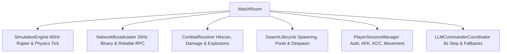

# VEXEA International — Deep Architectural Overhaul & Optimization Blueprint

**System Scope:** Core engine execution loops, server authoritativeness, spatial simulation pipelines, AI swarm scaling, and zero-allocation compliance.  
**Objective:** Provide high-leverage architectural directives and concrete implementation plans for engineering agents to execute without guessing or code drift.

---

## 1. Executive Architectural Audit & Systemic Bottlenecks

### 1.1 The Socket.IO Transport Fallback Degrades the Zero-Allocation Pipeline
- **Problem:** `server/transport/adapter.ts` and `client/transport/adapter.ts` contain:
  ```typescript
  const serializedPayload = { type: 'raw', data: Array.from(new Uint8Array(buffer)) };
  ```
  The binary packet is unpacked into a JavaScript array of numbers and wrapped in an object literal, running on **every 20Hz broadcast packet per client**. For 50 drones + cameras + player positions (1,600+ bytes), `Array.from` allocates thousands of JS array elements and heap objects 20 times a second per connected player.
- **Root Cause:** A temporary workaround for Socket.IO JSON messaging when Socket.IO natively supports native binary buffers (`Buffer` on Node, `ArrayBuffer` on browser).
- **Architectural Directive:**
  - Socket.IO supports native binary payloads directly: pass `Buffer.from(buffer)` on the server and receive `ArrayBuffer` on the client.
  - Eliminate `Array.from(new Uint8Array(buffer))` completely. Socket.IO engine transmits raw ArrayBuffers over WebSocket with zero JS heap array conversions.

### 1.2 Transport Constraints & Stream Hygiene (Socket.IO Authoritative)
- **Transport Mandate:** The real transport is strictly Socket.IO. Any references to Geckos.io/UDP in Architecture.md are aspirational and not implemented. Writing custom UDP or speculative secondary binary packet protocols is prohibited.
- **Problem:** `MatchRoom.ts:2039-2045` broadcasts `player.channel.emit("state_sync", ...)` alongside raw binary packed data every 50ms. `detailedPlayers` inside `state_sync` serializes unrounded floats, static strings, and dynamic arrays (`activeCollisions: []`), alongside debug payloads (`serverCube`, `devDrones`).
- **Consequences:**
  - Redundant JSON allocations and debug properties inflate WebSocket frame sizes across mobile clients.
- **Architectural Directive:**
  - Retain standard Socket.IO event architecture for high-level events, projectiles, and state synchronization. Do not write custom UDP or binary packet layouts for projectiles.
  - Strip debugging payloads (`serverCube`, `devDrones`) out of production match sync loops behind feature flag `DEBUG_PHYSICS_TICKS`.
  - Compact `detailedPlayers` serialization to prune redundant static properties and empty dynamic arrays, maintaining low per-tick payload sizes over Socket.IO without violating transport rules.

### 1.3 `MatchRoom.ts` God-Object (3,457 Lines) Decomposition Architecture
`MatchRoom` currently violates §13 (No Monoliths) by binding six decoupled lifecycles together:



- **Modular Breakdown Plan:**
  - `server/match/SimulationEngine.ts`: Manages `rapierWorld.step()`, physics accumulator, dynamic cubes, and sub-tick time synchronization.
  - `server/match/CombatResolver.ts`: Consolidates hitscan validation, rollback ring-buffer lookup, projectile integration (`projPosX`, `projVelX`), and splash damage calculations.
  - `server/match/SwarmLifecycle.ts`: Manages drone allocations, dead state recycling, camera health, and spawn points.
  - `server/match/PlayerSessionManager.ts`: Manages KCC movement calculation, AFK countdowns, disconnect grace periods, and inventory/slot reload timers.
  - `server/match/NetworkBroadcaster.ts`: Encapsulates `packWorldNetworkData`, player coordinate views, and socket channel dispatch.

---

## 2. Simulation & Algorithmic Hot-Loop Optimizations

### 2.1 Spatial Raycasting Contention in Drone AI
- **Observation:**
  - In `HumanoidBehavior.ts`, `findBestCoverPositionZeroGC` evaluates 4 candidate angles across 4 distances (16 candidate positions). For each, it executes a Rapier raycast plus a `collisionMap.rayIntersectsAny` check.
  - When 5–10 Humanoid drones are engaged in combat, up to **160 raycasts** execute within a single behavior tick.
  - In `DronePerception.ts`, `evaluateDronePerception` runs every tick for all living drones against all living players.
- **Optimization Strategy:**
  - **Temporal Staggering (Interleaved Ticks):** Drones already support modular modulus execution (`(room.serverTick + drone.id) % 3 === 0`). Perception checks for non-recon drones should be staggered across 4 ticks (15Hz effective evaluation). Human eye and reaction thresholds cannot differentiate 60Hz vs 15Hz sensory recognition when velocity interpolation is active.
  - **Hierarchical Bounding Box Pre-Filter:** Never run `collisionMap.rayIntersectsAny` or `rapierWorld.castRay` before testing broad-phase line-of-sight against static zone portals (`TOPOLOGY`). If player and drone are separated by multiple zones with closed intermediate portals, raycasting is bypassed entirely.

### 2.2 Hitscan Temporal Rollback Ring Buffer Alignment
- **File:** [hitscan.ts:62-126](file:///home/Alte/vexea-international/server/combat/hitscan.ts#L62-L126)
- **Problem:**
  - The linear search `for (let i = 0; i < HISTORICAL_SAMPLES_MAX; i++)` checks `Math.abs(recTick - targetTick) <= 1`.
  - The ring buffer is indexed circular sequentially: `(historicalAABBIndex + 1) % HISTORICAL_SAMPLES_MAX`.
  - Linear scan across 120 historic blocks is inefficient and unnecessary.
- **Optimization Directive:**
  - Because ticks advance monotonically, the delta between `currentRoom.serverTick` and `targetTick` directly maps to an exact ring buffer index offset:
    ```typescript
    const tickDelta = currentRoom.serverTick - targetTick;
    if (tickDelta >= 0 && tickDelta < HISTORICAL_SAMPLES_MAX) {
      const targetIndex = (currentRoom.historicalAABBIndex - tickDelta + HISTORICAL_SAMPLES_MAX) % HISTORICAL_SAMPLES_MAX;
      // Direct access baseIdx = targetIndex * HISTORIC_BLOCK_SIZE
    }
    ```
  - Eliminates the `O(N)` linear search loop entirely, replacing it with an `O(1)` index computation per fired bullet.

---

## 3. Client Pipeline & Render Loop Consolidations

### 3.1 Elimination of the `(window as any)` Global State Antipath
- **Problem:** Over **380 instances** of `(window as any)` pollute client subsystems (e.g., `(window as any).syncCameras`, `(window as any).camera`, `(window as any).audioManager`, `(window as any).vexeaSettings`).
- **Risks:**
  - High risk of race conditions during screen transitions (e.g. entering game from lobby before audio or camera is mounted).
  - Destroys TypeScript type safety and prevents modern tree-shaking and bundler minification.
- **Consolidation Plan:**
  - Implement a strongly typed `ClientContext` / `EngineHub` service injected into systems during `MatchController` construction:
    ```typescript
    export interface ClientEngineContext {
      camera: THREE.PerspectiveCamera;
      scene: THREE.Scene;
      audio: AudioManager;
      settings: VexeaSettings;
      vfx: VFXOrchestrator;
    }
    ```
  - Disallow exposing engine references onto `window`.

### 3.2 WebGPU / TSL Resource Lifecycle Governance
- **Mandate:** Project is locked to Three.js WebGPU with TSL shaders.
- **Issue:** In [NetworkSyncSystem.ts:24-42](file:///home/Alte/vexea-international/client/src/systems/NetworkSyncSystem.ts#L24-L42), `PositionalAudioPool` instantiates `new THREE.Mesh(this.geom, this.mat)` on demand and attaches/detaches objects to the scene dynamically (`scene.add(item.anchor)` / `scene.remove(item.anchor)`).
- **Optimization:**
  - Adding and removing scene graph nodes forces Three.js WebGPU pipeline render list re-evaluations.
  - Anchors must remain attached in the scene root permanently in an inactive state (`anchor.visible = false` or parked off-screen at `y = -9999`) to prevent scene graph mutations during gameplay.

---

## 4. LLM Swarm Commander Architecture (Gemini 3.5 / Multi-Adapter)

### 4.1 Token Bloat & Static Prompt Decoupling
- **Observation:**
  - `LLMCommander.ts:334-341` serializes dynamic zone summaries, outstanding orders, and previous cycle failures into a text string every 8 seconds.
  - Zone names, static topology links, and tool parameter descriptors do not change during a match.
- **Optimization Directive:**
  - Keep tool declarations and zone topology in cached system instructions (`systemInstruction`).
  - Compress `zoneSummary` to a compact array payload:
    - Instead of full JSON keys `{"zone": "zone_courtyard", "confidence": 1.0, "droneGroups": ["G1", "G2"]}`, transmit positional tuples: `["CY", 1.0, ["G1","G2"]]`.
  - Reduces prompt token expenditure by ~65%, cutting latency and API cost while staying well below rate limits.

### 4.2 Commander Action Validation Atomicity
- **Directive:**
  - The LLM step can return multiple actions (e.g., `move_group`, `set_posture`, `spawn_units`).
  - If one action fails (e.g., topology link between disconnected zones), other independent commands must still execute cleanly.
  - Validation failures must record the specific machine error in `failedOperations` with the attempted payload signature so the LLM receives immediate deterministic feedback in the next 8-second cycle without throwing runtime exceptions.

---

## 5. Security & Firestore Rules Lockdown

### 5.1 Critical Security Vulnerabilities
1. `match /matches_in_progress/{matchId}`:
   - Current rule: `allow read, write: if request.auth != null;`
   - **Exploit:** Any logged-in player can overwrite, corrupt, or wipe any match room session document in Firestore.
2. `match /Users/{playerId}`:
   - Current rule: `allow read, write: if request.auth != null && request.auth.uid == playerId;`
   - **Exploit:** While scoped to the user's UID, allowing direct client writes permits players to forge currency balances (`credits`, `energy`), battle pass tier progress, and loadout states.

### 5.2 Mandatory Phased Migration Sequence (Pre-Lockdown Prerequisite)
Directly deploying `allow write: if false;` immediately breaks live client code that performs direct client SDK writes:
- `client/firebase.ts:248`: `lockMatchSession` writes directly to `matches_in_progress/{matchId}`.
- `client/src/systems/ClassLoadoutPersistence.ts:204` & `ClassLoadoutSystem.ts:213`: write directly to `Users/{uid}`.
- `client/social.ts:251`: writes directly to `Users/{uid}`.

To prevent client permission-denied crashes, execution must follow a strict three-phase sequence:
- **Phase 5.2A (Authoritative Server API Endpoints):**
  - Implement `POST /api/match/lock` in `server/routes/api-routes.ts` using Firebase Admin SDK (`server/index.ts`) to manage match room session locks.
  - Implement `POST /api/player/loadout` in `server/routes/api-routes.ts` to validate and persist player class/loadout changes authoritatively.
  - Ensure profile/friend mutations in `social.ts` use existing server endpoints (`/api/player-profile`).
- **Phase 5.2B (Client Call Site Migration):**
  - Update `client/firebase.ts` to call `/api/match/lock` via authenticated `fetch()` instead of direct Firestore `setDoc`.
  - Update `ClassLoadoutPersistence.ts` and `ClassLoadoutSystem.ts` to call `/api/player/loadout`.
- **Phase 5.2C (Rules Lockdown):**
  - Once client-side write calls are fully migrated, deploy `firestore.rules` setting `allow write: if false;` for both `matches_in_progress/{matchId}` and `Users/{playerId}`.

---

## 6. Actionable Implementation Matrix for Successor Agents

| Task ID | Domain | Action Item | Target Files | Leverage |
|:---:|:---|:---|:---|:---:|
| **ARCH-01** | Transport | Replace `Array.from(new Uint8Array)` in Socket.IO adapters with direct binary Buffer transfer | [adapter.ts (client)](file:///home/Alte/vexea-international/client/transport/adapter.ts)<br>[adapter.ts (server)](file:///home/Alte/vexea-international/server/transport/adapter.ts) | **Critical** (Eliminates hot GC spikes) |
| **ARCH-02** | Monolith | Extract `MatchRoom.ts` into modular subsystems (`CombatResolver`, `PlayerSessionManager`, `SwarmLifecycle`, `SimulationEngine`) | [MatchRoom.ts](file:///home/Alte/vexea-international/server/MatchRoom.ts)<br>`server/match/*` | **High** (Unblocks safe team execution) |
| **ARCH-03** | Combat | Convert hitscan temporal rollback search from linear scan to $O(1)$ ring buffer index lookup | [hitscan.ts](file:///home/Alte/vexea-international/server/combat/hitscan.ts) | **High** (Reduces tick budget during intense combat) |
| **ARCH-04** | AI Simulation | Stagger perception evaluations and add zone-portal pre-culling for Raycast cover checks | [DronePerception.ts](file:///home/Alte/vexea-international/server/ai/DronePerception.ts)<br>[HumanoidBehavior.ts](file:///home/Alte/vexea-international/server/ai/behavior/behaviors/HumanoidBehavior.ts) | **High** (Prevents server tick-rate drops with >20 drones) |
| **ARCH-05** | Client Core | Replace `(window as any)` dependency injection with typed `ClientEngineContext` | [MatchController.ts](file:///home/Alte/vexea-international/client/MatchController.ts)<br>`client/src/systems/*` | **Medium** (Prevents runtime race conditions) |
| **ARCH-06** | Security | Phase 1: Implement authoritative server endpoints (`/api/match/lock`, `/api/player/loadout`); Phase 2: Migrate client call sites; Phase 3: Lock down `firestore.rules` | `server/routes/api-routes.ts`<br>`client/firebase.ts`<br>`client/src/systems/ClassLoadoutPersistence.ts`<br>[firestore.rules](file:///home/Alte/vexea-international/firestore.rules) | **Critical** (Closes client state tampering without breaking gameplay) |
| **ARCH-07** | LLM Engine | Compress `zoneSummary` prompt serialization to dense positional tuples | [LLMCommander.ts](file:///home/Alte/vexea-international/server/ai/LLMCommander.ts) | **Medium** (Cuts token usage & API latency) |
| **ARCH-08** | Client Physics | Eliminate drone kinematic colliders and worker messaging from client to enforce Architecture.md Section 1 law | `client/physics.worker.ts`<br>[SimulationSystem.ts](file:///home/Alte/vexea-international/client/src/systems/SimulationSystem.ts) | **High** (Enforces Architecture.md Section 1, saves mobile worker CPU) |
| **ARCH-09** | Render Pipeline | Remove phantom `EffectComposer`/`fxaaPass` code and align resolution handler to WebGPU/TSL | [main.ts](file:///home/Alte/vexea-international/client/main.ts)<br>[DynamicResolutionSystem.ts](file:///home/Alte/vexea-international/client/src/systems/DynamicResolutionSystem.ts) | **Low** (Removes dead rendering branch & bundle bloat) |
| **ARCH-10** | Camera Engine | Normalize `yawVelocity` camera banking tilt against delta-time spikes | [CameraEffects.ts](file:///home/Alte/vexea-international/client/src/camera/CameraEffects.ts) | **Medium** (Prevents sudden camera view snaps) |
| **ARCH-11** | Worker Topology | Remove hardcoded `map_1_facility.spec.json` static import from `physics.worker.ts` | [physics.worker.ts](file:///home/Alte/vexea-international/client/physics.worker.ts) | **High** (Enables multi-map client collisions) |
| **ARCH-12** | Weapon Grip | Decouple first-person `WeaponsContainer` from scene root; reparent under camera hierarchy | [weapons_model.ts](file:///home/Alte/vexea-international/client/weapons_model.ts) | **High** (Eliminates 1-frame position/jitter desync) |
| **ARCH-13** | Skeletal Posing | Guard bone `userData.origPos` against runtime overwrites and multi-instance mutation | [GripSystem.ts](file:///home/Alte/vexea-international/client/weapons/GripSystem.ts) | **Medium** (Prevents deformed skeletal bone offsets) |
| **ARCH-14** | Third-Person Rigs | Implement third-person weapon attachment and grip IK for remote players | [DroneSystem.ts](file:///home/Alte/vexea-international/client/src/systems/DroneSystem.ts) | **High** (Fixes unarmed remote players gliding across matches) |
| **ARCH-15** | Animation Blending | Drive remote player animation state transitions (Idle, Walk, Sprint, Fire) from velocity | [DroneSystem.ts](file:///home/Alte/vexea-international/client/src/systems/DroneSystem.ts) | **Medium** (Replaces static idle clip on moving remote players) |
| **ARCH-16** | Muzzle Sockets | Standardize muzzle and optic socket discovery with deterministic bone transforms | [weapons_model.ts](file:///home/Alte/vexea-international/client/weapons_model.ts) | **Medium** (Prevents offset bullet tracer spawning) |

---

## 7. Concrete Client Simulation & Engine Anomalies

### 7.1 Client Rapier Drone Collision Elimination (Architecture.md Law Enforcement)
- **Law Violation:** `ARCHITECTURE.md` Section 1 explicitly dictates:
  > "Client: Used ONLY for player kinematic character controller and static map geometry. Drones are NOT simulated in client-side Rapier."
- **Files:** `client/src/systems/SimulationSystem.ts:91-99`, `client/physics.worker.ts:155-189`
- **Problem:** `SimulationSystem.ts` filters and packages drone coordinates (`dronesData.push({ id, x: latest.posX, y: latest.posY, z: latest.posZ, type: latest.type })`) and sends them to `physics.worker.ts`. In turn, `physics.worker.ts:172-177` creates kinematic rigid bodies and cuboid colliders for each drone in the client Rapier world. Additionally, `SimulationSystem.ts:91` checks `if (latest.state !== 2)` where `2` is `DroneState.PURSUING` rather than `DroneState.DEAD` (`5`), causing pursuing drones to be omitted while dead drones are retained as colliders.
- **Consequences:**
  - Simulating drones in client Rapier violates `ARCHITECTURE.md` Section 1 law.
  - Generates unnecessary message allocations and worker thread overhead on mobile devices.
  - Causes ghost physical obstacles when colliding with drone positions on client.
- **Fix (Architecture Compliance):**
  1. Remove drone collider creation, updating, and removal in `client/physics.worker.ts` (`dronesMap`, `currentDroneIds`, and the `e.data.drones` handling loop).
  2. Remove drone coordinate packaging and postMessage transmission from `client/src/systems/SimulationSystem.ts`.
  3. Restrict client Rapier simulation exclusively to the player KCC and static map geometry as required by `ARCHITECTURE.md`.

### 7.2 Phantom WebGL `EffectComposer` & Postprocessing Residue
- **Files:** [client/main.ts:1353-1355](file:///home/Alte/vexea-international/client/main.ts#L1353-L1355), [client/src/systems/DynamicResolutionSystem.ts:147-156](file:///home/Alte/vexea-international/client/src/systems/DynamicResolutionSystem.ts#L147-L156), [client/src/settings/state.ts:83-88](file:///home/Alte/vexea-international/client/src/settings/state.ts#L83-L88)
- **Problem:** Uninstantiated `(window as any).composer` and `(window as any).fxaaPass` checks exist in render loops, resolution scaling, and settings state.
- **Consequence:** Three.js legacy WebGL postprocessing classes are bundled despite the project being locked to modern WebGPU/TSL.
- **Fix:** Remove `EffectComposer`, `RenderPass`, and `ShaderPass` imports from `main.ts` and clean legacy uniform accessors from `DynamicResolutionSystem`.

### 7.3 Camera Roll Angular Acceleration Spikes
- **File:** [client/src/camera/CameraEffects.ts:136-143](file:///home/Alte/vexea-international/client/src/camera/CameraEffects.ts#L136-L143)
- **Problem:** `yawVelocity = yawDelta / dt`, followed by spring physics accumulation scaled again by `dt`. During variable frame rates or micro-stutters, sudden changes in delta time cause extreme angular snapping.
- **Fix:** Pre-clamp `yawVelocity` before computing `targetRoll`.

### 7.4 Multi-Map Worker Collision Desync
- **File:** [client/physics.worker.ts:2](file:///home/Alte/vexea-international/client/physics.worker.ts#L2)
- **Problem:** Worker statically imports `map_1_facility.spec.json`, ignoring dynamic map configurations passed in `INIT` messages.
- **Fix:** Build collision geometry purely from dynamic `e.data.buildings` data passed during map load orchestration.

---

## 8. Player Rigging, Weapon Grips, Posing & Animation Architecture

### 8.1 First-Person Weapon Container Hierarchy Desync
- **File:** [client/weapons_model.ts:102-105](file:///home/Alte/vexea-international/client/weapons_model.ts#L102-L105) & [weapons_model.ts:507](file:///home/Alte/vexea-international/client/weapons_model.ts#L507)
- **Problem:**
  - `weaponsContainer` is added to `scene` (`scene.add(weaponsContainer)`) rather than directly parented to `camera`.
  - On every frame, [weapons_model.ts:507](file:///home/Alte/vexea-international/client/weapons_model.ts#L507) copies `camera.position` and applies Euler rotations and translations manually via `translateX`, `translateY`, `translateZ`.
- **Consequences:**
  - Because `weaponsContainer` resides in the scene root, its world matrix update order relative to the camera is dependent on scene traversal order.
  - When the camera is moved or shaken by `CameraEffectsSystem`, the weapon experiences a **1-frame latency/jitter delay** relative to the view frustum.
- **Architectural Directive:**
  - Parent the viewmodel rig directly to the camera: `camera.add(weaponsContainer)`.
  - Let Three.js scene-graph hierarchical matrix transforms naturally handle eye-tracking. Use local position/rotation offsets solely for recoil, sway, and ADS alignment.

### 8.2 Two-Point Hand Grip Constraint & Bone State Corruption
- **File:** [client/weapons/GripSystem.ts:153-200](file:///home/Alte/vexea-international/client/weapons/GripSystem.ts#L153-L200)
- **Problem:**
  - `applyScenicGripPose` mutates bone positions by reading and setting `bone.userData.origPos`.
  - If `applyScenicGripPose` is called consecutively with different configs or when an animation is blending, `origPos` is captured *after* previous modifications have already displaced the bone, permanently compounding spatial drift and causing deformed, dislocated limbs.
- **Architectural Directive:**
  - Store original bind-pose translations in a dedicated `Map<string, THREE.Vector3>` keyed by bone UUID immediately upon model loading, rather than lazily mutating `userData.origPos` at runtime.
  - Compute IK target positions as pure mathematical offsets from immutable rest-pose coordinates.

### 8.3 Remote Player Unarmed Gliding & Missing Weapon Grips
- **File:** [client/src/systems/DroneSystem.ts:604-685](file:///home/Alte/vexea-international/client/src/systems/DroneSystem.ts#L604-L685)
- **Problem:**
  - Remote player avatars are instantiated by cloning `Player_one-optimized.glb` ([DroneSystem.ts:610](file:///home/Alte/vexea-international/client/src/systems/DroneSystem.ts#L610)).
  - Only a single default `idle` animation clip is played:
    ```typescript
    const idleClip = animations.find(a => a.name.toLowerCase().includes("idle")) || animations[0];
    mixer.clipAction(idleClip).play();
    ```
  - **Remote players never attach or render their equipped weapons.** No weapon model is loaded or parented to `arm_right_hand` or `arm_left_hand`.
  - Remote players glide across the map in a frozen idle pose regardless of whether they are walking, sprinting, crouching, or firing.
- **Architectural Directive:**
  - **Weapon Attachment Socket:** In `DroneSystem`, when creating a remote player instance, load and attach the player's active weapon ([remotePlayersTargetData](file:///home/Alte/vexea-international/client/MatchController.ts#L97)) to the humanoid skeleton using `GripSystem`.
  - **Locomotion State Machine:** Crossfade `mixer` animations between `Idle`, `Walk`, and `Sprint` based on calculated velocity (`speed = movedDist / dt`), and trigger shooting recoil animations when `data.isFiring` is true.

### 8.4 Muzzle & Optical Socket Fallback Drift
- **File:** [client/weapons_model.ts:167-196](file:///home/Alte/vexea-international/client/weapons_model.ts#L167-L196)
- **Problem:**
  - When authored muzzle nodes are not found by exact string matching, `weapons_model.ts` uses fallback bone heuristics:
    ```typescript
    weaponBone = anySkinnedMesh.skeleton.bones.find(b => b.name.toLowerCase().includes('weapon') || ...);
    ```
    If no bone matches, it falls back to `bones[bones.length - 1]`.
  - Attaching `DynamicMuzzle` to arbitrary tail bones places bullet spawn positions inside the receiver or stock instead of the barrel tip, causing projectile origins and muzzle flashes to desync from the actual barrel.
- **Architectural Directive:**
  - Mandate strict authored anchor metadata in [shared/asset-details.ts](file:///home/Alte/vexea-international/shared/asset-details.ts) for all weapon models.
  - Ban arbitrary `bones[bones.length - 1]` fallbacks; enforce verified model-relative translation vectors when bone sockets are absent.


