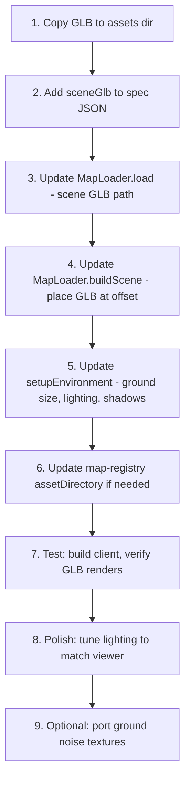

# Map Integration Plan: Authoring GLB → Vexea International

## Situation

**Goal:** Get a real map rendered in-game for a demo gameplay video.

### What Exists

| Artifact | Location | State |
|---|---|---|
| `facility-v3-final.glb` (744 KB, 12 meshes, 12 materials) | `/home/Alte/vexea-authoring/artifacts/` | ✅ Generated, gate-passed (art pass v7). Origin-centered coords. |
| `blockout-v3.json` (16 structures, routes, water, tunnels) | `/home/Alte/vexea-authoring/repo/blockout/` | ✅ Validated. Origin-centered: `[-460..460, -320..320]` |
| `viewer.html` (authoring preview) | `/home/Alte/vexea-authoring/repo/editor/` | ✅ WebGLRenderer, tuned lighting, ground noise. |
| `map_1_facility.spec.json` (game spec) | `/home/Alte/vexea-international/shared/maps/` | ⚠️ Has 20 buildings, 6 zones, spawns — but **all `meshFile: null`**. 768×768 offset coords. |
| `MapLoader.ts` | `/home/Alte/vexea-international/client/src/map/` | ⚠️ Pipeline exists but loads **nothing** — flat ground + centerpiece only. |
| `LoadingOrchestrator.ts` | Same dir | ✅ Full loading pipeline wired. |
| Physics colliders (server + client worker) | Rapier3D cuboids from spec buildings | ✅ Working from spec `buildings[].position + size`. |

### The Critical Gap

The game currently renders **only a flat dark plane + procedural centerpiece**. All `meshFile` fields in the spec are `null`, and there are **zero GLB assets** in `client/public/assets/maps/map_1/`.

The authoring repo has a finished, gate-passed 744 KB procedural GLB with buildings, roads, tunnels, cover objects, and facade details — but it sits unused.

### Coordinate System Mismatch

| | Authoring (`blockout-v3.json`) | Game (`map_1_facility.spec.json`) |
|---|---|---|
| **Origin** | Center `(0, 0, 0)` | Corner — ground plane at `(384, 0, 384)` |
| **World span** | `920 × 640` m (`[-460..460, -320..320]`) | `768 × 768` m (`[0..768, 0..768]`) |
| **Ground Y** | 0 | 0 |

---

## Integration Strategy

> [!IMPORTANT]
> **Approach: Load the GLB as a single scene-level asset, not per-building.**
>
> The GLB is already merge-optimized (12 draw calls). Splitting it back into per-building meshes would defeat the perf pass and require mapping each mesh to a spec building — unnecessary for the demo.

### Phase 1: Drop-In GLB Loading (Map Visuals)

**Files to modify:**

1. **Copy GLB to game assets**
   - Copy `facility-v3-final.glb` → `client/public/assets/maps/map_1/facility-v3.glb`

2. **Update `map_1_facility.spec.json`** — add a new top-level `sceneGlb` field:
   ```json
   "sceneGlb": "facility-v3.glb"
   ```
   And update `worldSize` to match authoring dimensions:
   ```json
   "worldSize": { "x": 920, "z": 640 }
   ```

3. **Update [`MapLoader.ts`](file:///home/Alte/vexea-international/client/src/map/MapLoader.ts)** — add scene-level GLB loading:
   - In `load()`: if `spec.sceneGlb` exists, load it via `GLTFLoader` into `this.loadedAssets` under a special key `'__scene__'`.
   - In `buildScene()`: if `__scene__` asset exists, add it to scene with correct offset position so origin `(0,0,0)` in the GLB maps to the world center.
   - Keep existing per-building path for any buildings that DO have `meshFile` (future-proof).

4. **Update `setupEnvironment()` in `MapLoader.ts`**:
   - Resize ground plane to match new `worldSize` (920 × 640 instead of 768 × 768).
   - Position ground at world center.
   - Match lighting closer to authoring viewer (sun direction, intensity, IBL).
   - Add baked procedural ground noise textures from `viewer.html`.
   - Enable shadow maps for GLB meshes (`castShadow = receiveShadow = true`).

5. **Update [`map-registry.ts`](file:///home/Alte/vexea-international/shared/maps/map-registry.ts)**:
   - Verify `assetDirectory` points to the right path for the new GLB.

### Phase 2: Coordinate Reconciliation (Physics + Zones)

The spec's zones/buildings/spawns use `[0..768]` offset coords. The GLB uses origin-centered coords. Two options:

> [!TIP]
> **Option A (Recommended): Offset the GLB on load.**
> Position the loaded GLB group at `(460, 0, 320)` so its origin-centered geometry aligns with the current spec coordinate system (buildings at positive coords). This requires NO changes to server physics, zones, spawns, or collision code.
>
> However, the spec buildings don't align 1:1 with blockout-v3 structures (different count, different coordinates, different world size). So colliders will be approximate.

> **Option B: Rewrite the spec to match authoring coords.**
> Generate a new spec from `blockout-v3.json` with matching structures. This gives accurate colliders but requires updating every position in the spec + server constants + shared zone bounds.

**For demo video:** Option A is sufficient. The visual map will look right, player can walk around, drones spawn. Collider alignment is approximate but acceptable for a demo.

### Phase 3: Lighting & Atmosphere Polish

Port the authoring viewer's tuned lighting rig into `MapLoader.setupEnvironment()`:

| Parameter | Current (MapLoader) | Target (viewer.html) |
|---|---|---|
| Ground color | `0x1f232a` | `0x7b7567` (warm asphalt) |
| Ground size | 768×768 | 920×640 (2200×1800 in viewer, but gameplay is 920×640) |
| Sun color/intensity | `0xffddbb / 0.6` | `0xfff2dd / 3.4` |
| Sun position | `(100, 200, 50)` | `(-450, 380, 320)` (raking shadows) |
| Ambient | `0xE8E8E8 / 0.4` | Hemisphere `0xa8bdd2 / 0x4a4842 / 0.08` |
| Tone mapping | None? | ACES Filmic, exposure 0.85 |
| Shadows | Disabled | PCFShadowMap, 2048×2048, tight frustum |
| Fog | `Fog(0x8899aa, 80, 400)` | `FogExp2(0xa8bdd2, 0.0007)` |
| Sky/background | HDR attempt | Solid `0xa8bdd2` (overcast) |
| IBL | HDR file | RoomEnvironment PMREM @ 0.04 |

### Phase 4: Ground Noise Texture (Optional Polish)

Port the `noiseTexture()` function from `viewer.html` for baked procedural ground variation. This is purely cosmetic — skip for speed if needed.

---

## Execution Order



## Risk Assessment

| Risk | Mitigation |
|---|---|
| WebGPU vs WebGL renderer mismatch (viewer uses WebGL, game uses WebGPU with WebGL fallback) | GLB materials are `MeshStandardMaterial` — compatible with both renderers. TSL import path in MapLoader already uses `three/webgpu`. |
| Coordinate misalignment between GLB geometry and physics colliders | For demo: acceptable. Colliders are approximate boxes anyway. |
| GLB too dark / too bright in game renderer | Port lighting rig parameters exactly from viewer.html. |
| `MeshStandardMaterial` in GLB vs `MeshStandardNodeMaterial` in game | Standard materials work fine under WebGPU renderer — they auto-convert. |
| Ground plane z-fighting with GLB ground-level geometry | GLB ground elements are at Y=0.08+ (road ribbons). Set ground plane at Y=-0.01. |

## Files Changed (Summary)

| File | Change |
|---|---|
| `client/public/assets/maps/map_1/facility-v3.glb` | **New** — copy from authoring |
| `shared/maps/map_1_facility.spec.json` | Add `sceneGlb` field, update `worldSize` |
| `client/src/map/MapLoader.ts` | Scene-level GLB loading, lighting overhaul, ground resize |
| `shared/maps/map-registry.ts` | Verify/update `assetDirectory` |
